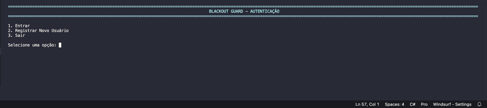
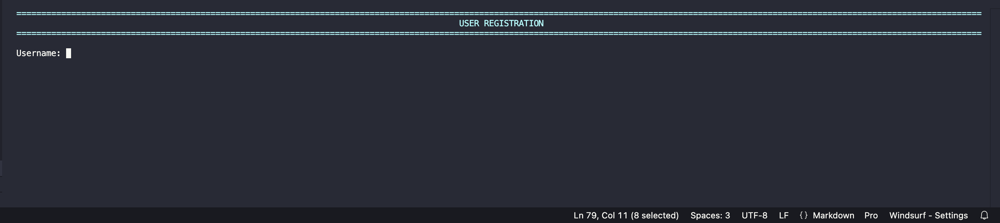
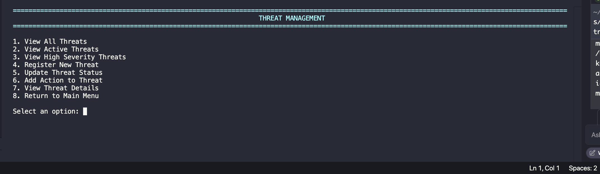
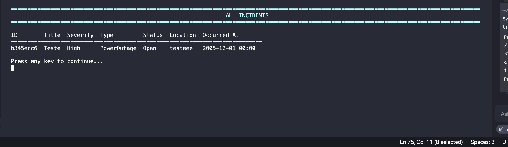
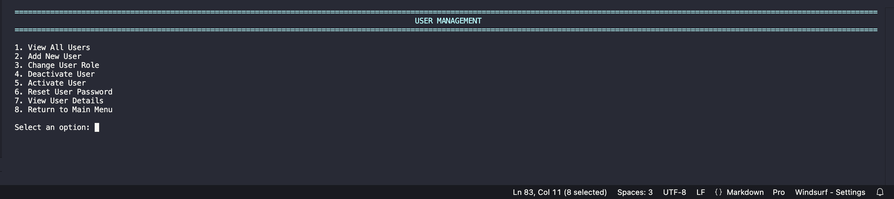
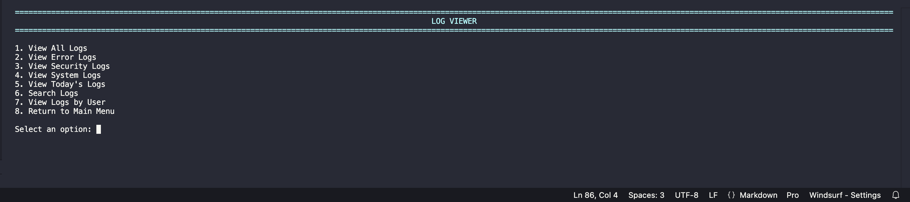

# BlackoutGuard - Power Grid Cybersecurity System

# Alunos
Gustavo Vegi / RM550188  
Pedro Henrique Silva de Morais / RM98804

---
# Video Pitch
https://www.youtube.com/watch?v=v09cErSpkwc

# Documentação Técnica do Projeto

## Sumário

1. [Objetivo do Projeto](#objetivo-do-projeto)
2. [Problema e Solução](#problema-e-solução)
3. [Requisitos](#requisitos)
   - [Requisitos Funcionais](#requisitos-funcionais)
   - [Requisitos Não Funcionais](#requisitos-não-funcionais)
4. [Fluxogramas](#fluxogramas)
5. [Tecnologias Utilizadas](#tecnologias-utilizadas) 
6. [Arquitetura](#arquitetura)
7. [Regras de Negócio](#regras-de-negócio)
8. [Funcionalidades Principais](#funcionalidades-principais)

---

## Objetivo do Projeto

O BlackoutGuard é um sistema de cibersegurança especializado na proteção de infraestruturas de redes elétricas, desenvolvido para prevenir, identificar e responder a ameaças cibernéticas que possam causar interrupções no fornecimento de energia. O sistema oferece uma plataforma integrada para monitoramento em tempo real, detecção de ameaças, resposta a incidentes e análise de vulnerabilidades específicas para o setor energético.

## Problema e Solução

### Problema
Redes de energia elétrica são cada vez mais alvo de ataques cibernéticos sofisticados que podem provocar blackouts, danos à infraestrutura e riscos à segurança pública. Os sistemas de segurança tradicionais frequentemente são reativos e carecem de ferramentas especializadas para enfrentar os desafios únicos da cibersegurança em redes elétricas.

### Solução
O BlackoutGuard preenche essa lacuna fornecendo uma solução especializada para:
- Monitoramento contínuo da infraestrutura de rede elétrica
- Detecção proativa de ameaças específicas do setor energético
- Resposta rápida a incidentes com procedimentos específicos para manutenção da continuidade operacional
- Análise avançada de vulnerabilidades com classificação CVSS adaptada para infraestruturas críticas
- Sistema de alertas com priorização baseada no impacto potencial ao fornecimento de energia

## Requisitos

### Requisitos Funcionais

1. **Gerenciamento de Usuários e Autenticação:**
   - RF01: O sistema deve permitir cadastro de usuários com diferentes níveis de acesso
   - RF02: O sistema deve autenticar usuários através de credenciais seguras
   - RF03: O sistema deve permitir a recuperação de senha através de procedimento seguro
   - RF04: O sistema deve manter log de todas as atividades de login e logout

2. **Monitoramento e Detecção de Ameaças:**
   - RF05: O sistema deve registrar e categorizar ameaças cibernéticas
   - RF06: O sistema deve permitir a definição de níveis de severidade para ameaças
   - RF07: O sistema deve identificar padrões de ataques através de análise de logs
   - RF08: O sistema deve associar ameaças a componentes específicos da infraestrutura

3. **Gestão de Incidentes:**
   - RF09: O sistema deve permitir o registro completo de incidentes de segurança
   - RF10: O sistema deve possibilitar o acompanhamento do ciclo de vida dos incidentes
   - RF11: O sistema deve permitir a atribuição de incidentes a usuários específicos
   - RF12: O sistema deve categorizar incidentes por tipo, severidade e impacto
   - RF13: O sistema deve registrar todas as ações tomadas durante a resposta ao incidente

4. **Vulnerabilidades:**
   - RF14: O sistema deve permitir o registro e classificação de vulnerabilidades
   - RF15: O sistema deve calcular scores CVSS para vulnerabilidades identificadas
   - RF16: O sistema deve associar vulnerabilidades a componentes da infraestrutura
   - RF17: O sistema deve sugerir medidas de mitigação para cada vulnerabilidade
   - RF18: O sistema deve rastrear o estado de correção de cada vulnerabilidade

5. **Alertas:**
   - RF19: O sistema deve gerar alertas baseados em eventos predefinidos
   - RF20: O sistema deve classificar alertas por prioridade e impacto
   - RF21: O sistema deve requerer confirmação de alertas críticos
   - RF22: O sistema deve escalar alertas não-confirmados após tempo configurável

6. **Logs e Auditoria:**
   - RF23: O sistema deve registrar eventos de segurança em logs persistentes
   - RF24: O sistema deve permitir a consulta e filtragem de logs históricos
   - RF25: O sistema deve garantir a integridade dos registros de log
   - RF26: O sistema deve permitir a exportação de logs para análise externa

7. **Relatórios:**
   - RF27: O sistema deve gerar relatórios periódicos de segurança
   - RF28: O sistema deve permitir relatórios customizados por tipo de evento, período e severidade
   - RF29: O sistema deve oferecer visualizações gráficas de indicadores de segurança
   - RF30: O sistema deve permitir agendamento de relatórios automáticos

### Requisitos Não Funcionais

1. **Segurança:**
   - RNF01: As senhas devem ser armazenadas com algoritmos de hash seguros e salt
   - RNF02: O sistema deve implementar proteção contra ataques de força bruta
   - RNF03: Todas as comunicações de rede devem ser criptografadas
   - RNF04: O sistema deve implementar controle de acesso baseado em funções (RBAC)
   - RNF05: O sistema deve detectar e prevenir injeções SQL e XSS

2. **Desempenho:**
   - RNF06: O sistema deve processar e exibir alertas críticos em menos de 1 segundo
   - RNF07: Consultas a logs devem retornar resultados em menos de 3 segundos
   - RNF08: O sistema deve suportar pelo menos 100 usuários simultâneos
   - RNF09: O tempo de resposta para operações comuns não deve exceder 2 segundos

3. **Disponibilidade:**
   - RNF10: O sistema deve estar disponível 99,9% do tempo (uptime)
   - RNF11: O tempo de recuperação após falha não deve exceder 5 minutos
   - RNF12: Backups dos dados devem ser realizados automaticamente a cada 24 horas

4. **Usabilidade:**
   - RNF13: A interface deve ser navegável por teclado para todos os principais recursos
   - RNF14: O sistema deve fornecer mensagens de erro claras e orientadas a solução
   - RNF15: As operações críticas devem requerer confirmação do usuário
   - RNF16: A interface deve ser acessível em monitores com resolução mínima de 1024x768

5. **Manutenibilidade:**
   - RNF17: O código deve seguir padrões consistentes de nomenclatura e estrutura
   - RNF18: O sistema deve ser modular para facilitar atualizações de componentes
   - RNF19: O sistema deve incluir testes unitários para funções críticas
   - RNF20: A documentação técnica deve ser mantida atualizada com cada release

6. **Portabilidade:**
   - RNF21: O sistema deve ser executável em Windows, Linux e macOS
   - RNF22: Os dados devem ser armazenados em formato portável (JSON)

## Fluxogramas

### Fluxo de Autenticação e Controle de Acesso

```
┌─────────────┐     ┌──────────────┐     ┌────────────────┐
│  Início     │────▶│ Tela de Login │────▶│ Validação de   │
└─────────────┘     └──────────────┘     │ Credenciais    │
                                         └────────┬───────┘
                                                  │
                    ┌────────────────┐           │
                    │ Menu Principal │◀───┐      │
                    └────────┬───────┘    │      │
                             │            │      │
              ┌──────────────▼──────────┐ │      │
              │ Verificação de Permissão│ │      │
              └──────────────┬──────────┘ │      │
                             │            │      │
┌─────────────┐    ┌─────────▼────────┐   │      │
│ Acesso      │◀───┤ Permissão       │───┘      │
│ Negado      │    │ Concedida?      │          │
└─────────────┘    └─────────────────┘          │
     │                                           │
     │              ┌────────────────┐           │
     └─────────────▶│   Fim         │◀──────────┘
                    └────────────────┘
```

### Fluxo de Gestão de Incidentes

```
┌───────────────┐     ┌────────────────┐     ┌─────────────────┐
│ Detecção de   │────▶│ Registro do    │────▶│ Classificação   │
│ Incidente     │     │ Incidente      │     │ por Severidade  │
└───────────────┘     └────────────────┘     └────────┬────────┘
                                                      │
                     ┌────────────────────────────────▼───────┐
                     │                                         │
              ┌──────▼───────┐                    ┌───────────▼──────┐
              │ Baixa/Média  │                    │ Alta/Crítica     │
              │ Severidade   │                    │ Severidade       │
              └──────┬───────┘                    └────────┬─────────┘
                     │                                     │
        ┌────────────▼────────────┐         ┌─────────────▼────────────┐
        │ Atribuição a Analista   │         │ Notificação Imediata     │
        │ para Análise            │         │ e Protocolo de Resposta  │
        └────────────┬────────────┘         └─────────────┬────────────┘
                     │                                     │
                     └──────────────┬─────────────────────┘
                                    │
                      ┌─────────────▼────────────┐
                      │ Investigação e           │
                      │ Implementação de Solução │
                      └─────────────┬────────────┘
                                    │
                      ┌─────────────▼────────────┐
                      │ Documentação de Ações    │
                      │ e Lições Aprendidas      │
                      └─────────────┬────────────┘
                                    │
                      ┌─────────────▼────────────┐
                      │ Fechamento do Incidente  │
                      └──────────────────────────┘
```

### Fluxo de Gestão de Vulnerabilidades

```
┌───────────────┐    ┌────────────────┐    ┌─────────────────┐
│ Identificação │───▶│ Análise e      │───▶│ Cálculo CVSS    │
│ Vulnerabilidade│    │ Classificação  │    │ e Priorização   │
└───────────────┘    └────────────────┘    └────────┬────────┘
                                                    │
         ┌───────────────────────────────────────────▼─────────────────┐
         │                                                             │
┌────────▼───────────┐                                    ┌────────────▼─────────┐
│ Vulnerabilidade    │                                    │ Vulnerabilidade      │
│ Baixa/Média        │                                    │ Alta/Crítica         │
└────────┬───────────┘                                    └────────────┬─────────┘
         │                                                             │
┌────────▼───────────┐                                    ┌────────────▼─────────┐
│ Programação        │                                    │ Implementação        │
│ para Correção      │                                    │ Imediata de Correção │
└────────┬───────────┘                                    └────────────┬─────────┘
         │                                                             │
         └───────────────────────────┬─────────────────────────────────┘
                                     │
                         ┌───────────▼──────────┐
                         │ Verificação da       │
                         │ Eficácia da Correção │
                         └───────────┬──────────┘
                                     │
                         ┌───────────▼──────────┐
                         │ Documentação         │
                         │ e Fechamento         │
                         └──────────────────────┘
```

## Tecnologias Utilizadas

### Linguagem e Framework
- **C#:** Linguagem principal de desenvolvimento
- **.NET 9.0:** Framework para desenvolvimento da aplicação

### Padrões de Projeto
- **Arquitetura em Camadas:** Separação clara entre modelo, serviços e interface
- **Repository Pattern:** Para abstrair o acesso aos dados
- **Dependency Injection:** Para gerenciar dependências entre serviços
- **Service Layer:** Para encapsular lógica de negócios

### Armazenamento de Dados
- **JSON:** Formato para persistência de dados
- **Sistema de Arquivos:** Armazenamento de arquivos de logs e dados do sistema

### Segurança
- **Criptografia de Senhas:** Implementação de hashing com salt
- **RBAC (Role-Based Access Control):** Para controle de permissões
- **Validação de Entrada:** Para prevenção de injeções e outros ataques

### Interface
- **Console UI:** Interface de linha de comando interativa
- **ASCII Art:** Para melhorar a experiência visual no console

### Ferramentas de Desenvolvimento
- **Visual Studio/VS Code:** Ambiente de desenvolvimento
- **Git:** Sistema de controle de versão
- **NuGet:** Gerenciamento de pacotes

## Capturas de Tela

### Autenticação e Registro

<div style="display: flex; justify-content: space-between;">
  <div style="flex: 1; margin-right: 10px;">
    
    <p align="center"><i>Tela de Login</i></p>
  </div>
  <div style="flex: 1; margin-left: 10px;">
    
    <p align="center"><i>Registro de Novo Usuário</i></p>
  </div>
</div>

### Gestão de Segurança

<div style="display: flex; flex-wrap: wrap; justify-content: space-between;">
  <div style="flex-basis: 48%; margin-bottom: 15px;">
    
    <p align="center"><i>Gerenciamento de Ameaças</i></p>
  </div>
  <div style="flex-basis: 48%; margin-bottom: 15px;">
    
    <p align="center"><i>Lista de Incidentes</i></p>
  </div>
</div>

### Administração e Monitoramento

<div style="display: flex; flex-wrap: wrap; justify-content: space-between;">
  <div style="flex-basis: 48%; margin-bottom: 15px;">
    
    <p align="center"><i>Gerenciamento de Usuários</i></p>
  </div>
  <div style="flex-basis: 48%; margin-bottom: 15px;">
    
    <p align="center"><i>Logs do Sistema</i></p>
  </div>
</div>

## Requisitos do Sistema

- **.NET 7.0** ou superior
- Sistema operacional Windows, macOS ou Linux
- Acesso de terminal com entrada interativa

## Primeiros Passos

1. Clone o repositório
   ```bash
   git clone https://github.com/seu-usuario/BlackoutGuard.git
   ```

2. Navegue até o diretório do projeto
   ```bash
   cd BlackoutGuard
   ```

3. Compile a aplicação
   ```bash
   dotnet build
   ```

4. Execute a aplicação
   ```bash
   dotnet run
   ```

5. Faça login com as credenciais padrão
   - Usuário: `admin`
   - Senha: `admin123`

## Arquitetura

O BlackoutGuard segue uma arquitetura em camadas:

- **Modelos**: Classes que representam entidades do sistema (User, Alert, Incident, etc.)
- **Serviços**: Lógica de negócios para operações do sistema
- **Interface de Usuário**: Componentes de console para interação
- **Persistência**: Armazenamento baseado em JSON para dados do sistema

## Funções de Usuário

- **Administrador**: Acesso completo ao sistema
- **Analista**: Visualiza e analisa ameaças e incidentes
- **Operador**: Gerencia operações do dia a dia
- **Auditor**: Acesso apenas para visualização e auditoria

## Regras de Negócio

### Autenticação e Controle de Acesso
1. **RN01:** Todos os usuários devem se autenticar antes de acessar qualquer recurso do sistema
2. **RN02:** Senhas devem conter no mínimo 8 caracteres, incluindo letras maiúsculas, minúsculas, números e caracteres especiais
3. **RN03:** Após 5 tentativas falhas de login, a conta deve ser bloqueada por 15 minutos
4. **RN04:** Usuários administradores são os únicos que podem criar novos usuários ou alterar níveis de acesso
5. **RN05:** Sessões inativas por mais de 30 minutos devem ser automaticamente encerradas

### Gestão de Alertas
6. **RN06:** Alertas críticos devem ser reconhecidos dentro de 15 minutos após sua emissão
7. **RN07:** Alertas não reconhecidos devem ser escalados para nível hierárquico superior após o tempo limite
8. **RN08:** Todo alerta deve ser classificado por prioridade (Baixa, Média, Alta, Crítica)
9. **RN09:** Alertas críticos devem gerar notificações imediatas no sistema
10. **RN10:** Encerramento de alertas requer documentação obrigatória das ações tomadas

### Vulnerabilidades
11. **RN11:** Todas as vulnerabilidades devem ser classificadas utilizando o padrão CVSS (Common Vulnerability Scoring System)
12. **RN12:** Vulnerabilidades com classificação alta ou crítica devem ter plano de mitigação iniciado em até 24 horas
13. **RN13:** Avaliações de vulnerabilidade devem ser realizadas no mínimo a cada 30 dias
14. **RN14:** Toda vulnerabilidade deve ter associação com o componente do sistema afetado
15. **RN15:** Vulnerabilidades não resolvidas após o prazo definido devem ser escaladas para a gestão

### Incidentes
16. **RN16:** Todos os incidentes de segurança devem ser obrigatoriamente registrados com data, hora e nível de severidade
17. **RN17:** Incidentes críticos devem ter seu processo de resposta iniciado em até 30 minutos
18. **RN18:** Todo incidente deve ser atribuído a um responsável para acompanhamento
19. **RN19:** Incidentes resolvidos devem incluir documentação detalhada da causa raiz e solução aplicada
20. **RN20:** Análise pós-incidente é obrigatória para todos os incidentes de severidade alta ou crítica

### Logs e Auditoria
21. **RN21:** Todos os eventos de segurança devem ser registrados em logs com retenção mínima de 365 dias
22. **RN22:** Logs não podem ser alterados ou excluídos, apenas consultados
23. **RN23:** Backups regulares dos dados do sistema devem ser realizados diariamente
24. **RN24:** Toda ação administrativa deve ser registrada com identificação do usuário executor

### Relatórios
25. **RN25:** Relatórios resumidos de segurança devem ser gerados semanalmente
26. **RN26:** Relatórios detalhados devem ser gerados mensalmente
27. **RN27:** Métricas de segurança devem ser atualizadas em tempo real no dashboard
28. **RN28:** Relatórios de vulnerabilidades não resolvidas devem ser enviados automaticamente para a gestão

## Melhorias Futuras

- Integração com sistemas SCADA
- Previsão de ameaças baseada em aprendizado de máquina
- Aplicativo móvel para alertas em movimento
- Integração com sistemas de segurança física
- Dashboard de análise em tempo real

## Licença

Este projeto está licenciado sob os termos da licença MIT. Veja o arquivo LICENSE para mais detalhes.

---

<div align="center">
  <p>Desenvolvido por Pedro Morais/ Gustavo Vegi - 2025</p>
  <p>
    <a href="https://github.com/seu-usuario">GitHub</a> •
    <a href="https://linkedin.com/in/seu-perfil">LinkedIn</a>
  </p>
</div>